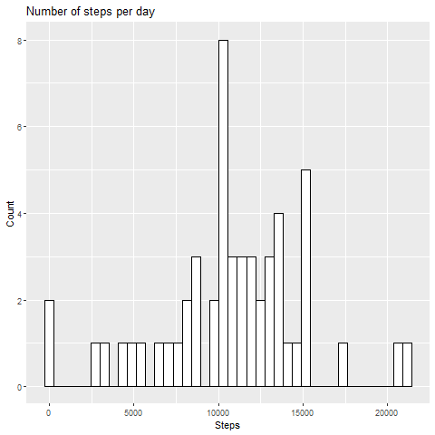
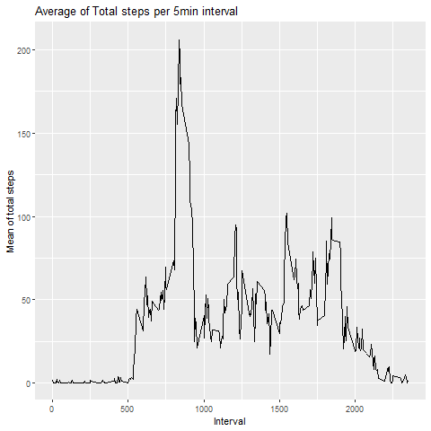
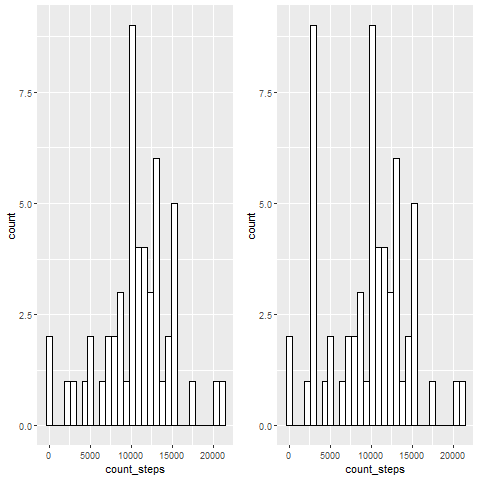
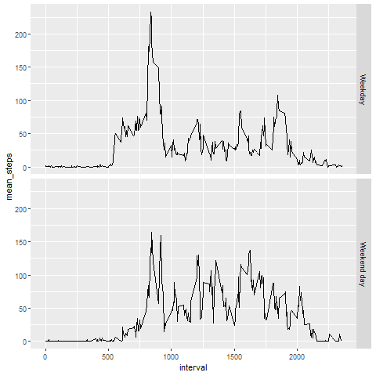

## Assignment_week_2


### Loading and preprocessing the data

```r
atv_data <- read.csv('./data/activity.csv')
```

### What is mean total number of steps taken per day?

With **dplyr** package, we can group the data by the *date* variable and sum the *steps* variable

```r
library(dplyr)

steps_day<- atv_data %>% 
        group_by(date) %>%
        summarise(
                count_steps = sum(steps),
        )
```
With **ggplot2** package we can get the requested histogram
```r
library(ggplot2)

ggplot(steps_day, aes(x=count_steps)) + 
        geom_histogram(bins=40,
                       color="black",fill="white") + 
        labs(title="Number of steps per day", 
             x='Steps', 
             y='Count')
```



Mean, median and I also included the standard deviation of steps taken by day
```r
mean_median_sd<-
        as.data.frame(
                cbind(
                        Mean=mean(steps_day$count_steps,na.rm=T),
                        Median=median(steps_day$count_steps,na.rm=T),
                        Standard_Deviation=sd(steps_day$count_steps,na.rm=T)
                        )
                )
```
### What is the average daily activity pattern?

First we need to do another aggregation, but now grouping by *interval* instead of *date*
```r
mean_steps_intv<- atv_data %>% 
        group_by(interval) %>%
        summarise(
                mean_steps = mean(steps,na.rm=TRUE),
        )
```
Then we can do a time series plot using **ggplot2**
```r
ggplot(mean_steps_intv, aes(x=interval, y=mean_steps)) +
        geom_line() + 
        labs(title="Average of Total steps per 5min interval", 
             x='Interval', 
             y='Mean of total steps')
```
 


### 5-min interval containing the maximum number of steps?

We can use **which.max** function to find the index and then search for the rows
```r
mean_steps_intv[which.max(mean_steps_intv$mean_steps),]
```

### Imputing missing values

We can sum the True and False array generated by **is.na** function to count the total amount of NAs
```r
sum(is.na(atv_data))
```

Since the mean imputation decreases the variance and therefore increases the bias narrowing
the accuracy and the confidence interval, using k-Nearest Neighbour imputation looks like to be a better option.

We need to download the package **VIM** and then use the function **KNN** to replace the NA values by the k-Nearest Neighbour
```r
library(VIM)
atv_data_knn<-kNN(atv_data,variable = "steps")
```

### Histogram of the total number of steps taken each day using the new dataset

First, wee need to do a similar aggregation by *date* with the new dataset
```r
steps_day_knn<- atv_data_knn %>% 
        group_by(date) %>%
        summarise(
                count_steps = sum(steps),
                mean_steps = mean(steps,na.rm=TRUE),
                median_steps = median(steps,na.rm=TRUE)
        )

```
Then we can compare the plots
```r
plot1<-ggplot(steps_day, aes(x=count_steps)) + geom_histogram(color="black", fill="white")
plot2<-ggplot(steps_day_knn, aes(x=count_steps)) + geom_histogram(color="black", fill="white")

require(gridExtra)
grid.arrange(plot1, plot2, ncol=2)
```
 


Since we are putting new values based on KNN imputation and these imputed values are not extreme, the mean and median are reduced and the variance is slightly increased which makes sense.
```r
mean_median_sd_knn<-
        as.data.frame(
                cbind(
                        Mean=mean(steps_day_knn$count_steps,na.rm=T),
                        Median=median(steps_day_knn$count_steps,na.rm=T),
                        Standard_Deviation=sd(steps_day_knn$count_steps,na.rm=T)
                        )
                )
```

### Are there differences in activity patterns between weekdays and weekends?

For make it universal I set the **weekdays** function output to english
```r
sys_eng<-Sys.setlocale("LC_TIME", "C")
```
Then using **ifelse** conditions we can create the required factor variable 

```r
atv_data_knn$weekday<-ifelse(
        weekdays(atv_data_knn$date)=="Saturday" | weekdays(atv_data_knn$date)=="Sunday",
        "Weekend day", 
        "Weekday")

atv_data_knn$weekday<-as.factor(atv_data_knn$weekday)
```

### Panel plot containing the average steps in Weekdays and weekends

First we need to aggregate by *interval* and *weekday* fields
```r
steps_day_knn_weekday<- atv_data_knn %>% 
        group_by(interval,weekday) %>%
        summarise(
                count_steps = sum(steps),
                mean_steps = mean(steps,na.rm=TRUE),
                median_steps = median(steps,na.rm=TRUE)
        )

```

Then we can use **ggplot2** and set the **facet_grid** parameter as *weekday*
```r
ggplot(steps_day_knn_weekday, aes(interval, mean_steps)) + geom_line() + facet_grid(weekday ~ .)
```
 


There are some differences in number of steps taken between week days and weekends. Looks like during the weekdays the mean between 500 and 1000 steps is greater than in weekends but the mean between 1000 and 2000 looks greater in weekends than in weekdays.

This might suggest that during the week days people walk because they need to go to work which implies a reasonable and more a less standard amount of steps to be taken.

During the weekends people may have more time to run or have longer walks which implies a more considerable amount of steps. 
